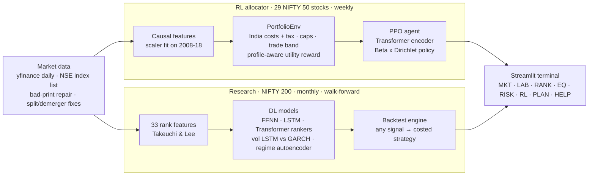

<div align="center">

# NiveshRL

**A deep-learning research terminal for Indian equities**

Daily trading desk · news sentiment (FinBERT) · next-day model · screener · watchlist alerts · stock rankers · volatility · regimes · RL allocation · a backtest lab that charges real NSE costs

Streamlit web terminal **and** a native Windows desktop app (PySide6 + a C++ core)


</div>

> **Educational research project, not investment advice.** NiveshRL is not registered with SEBI. Backtests use historical data and carry survivorship bias ([Limitations](#limitations)).

## What it is

NiveshRL asks whether deep learning adds anything over classic methods for **Indian equities, once real trading costs are paid**. It answers honestly: every prediction is walk-forward out-of-sample, and every trade pays contract-note-accurate NSE charges.

| Module | Model | Question it answers |
| --- | --- | --- |
| **Stock ranker** | FFNN 33-40-**4**-50-1 (Takeuchi & Lee), LSTM, Transformer vs logistic regression and 12-1 momentum | Which NIFTY 200 stocks will beat the median next month? |
| **Volatility forecaster** | LSTM vs GARCH(1,1), EWMA, historical | How volatile will each stock be next month? |
| **Regime detector** | autoencoder → 2-D embedding → k-means, refit yearly | Is the market in a Bull, Neutral or Stress state right now? |
| **RL allocator** | PPO actor-critic: permutation-equivariant Transformer encoder, Beta × Dirichlet policy | How should *this* investor split money across 29 NIFTY 50 stocks and cash? |
| **Backtest lab** | vectorised engine + India cost/tax model (C++ inner loop) | What would a strategy built on any signal really have earned after costs? |
| **Next-day model** | LightGBM + 1-D CNN/Transformer sequence net, isotonic-calibrated ensemble | Which stocks are worth *watching* tomorrow? |
| **News sentiment** | FinBERT (ProsusAI/finbert) on Google News headlines | What is the news saying about each stock in the last 48 h? |
| **Daily desk** | briefing, measured market habits, screener, analyst score, watchlist alerts | What happened today, and what should I look at tomorrow? |

## The terminal

`streamlit run app.py` opens a dark, terminal-style dashboard with eleven screens (the desktop app has the same ones as dockable panels, see [Desktop app](#desktop-app-windows)):

| Screen | What you can do |
| --- | --- |
| **TODAY** Daily briefing | What happened (deterministic narrative from the numbers), sectors, results this week, your watchlist, **top stocks to monitor tomorrow** (strength / weakness lists with reasons), measured market habits (day of week, after ±2% days, streaks, intraday first-hour direction) |
| **SCRN** Screener | ~80 technical, fundamental, analyst, sentiment and model columns for the NIFTY 200; 8 presets (momentum breakout, oversold quality, value, high dividend, earnings this week, positive news buzz, strong trend, model favourites) plus custom AND filters; CSV export |
| **WATCH** Watchlist | ★ Must have / ☆ Preferred tiers, notes, buy/sell targets; live price, P(up), sentiment, analyst score, days to results; alert badges (target hit, ±3% move, sentiment flip, results within 7 days, entered/left the top list) |
| **MKT** Market monitor | **Live prices** (Yahoo Finance stream, refreshed every few seconds), NIFTY/VIX with regime shading, a NIFTY 200 sector heatmap (1D to 1Y), breadth, advancers/decliners, movers, the models' consensus picks. **Click any stock in the heatmap** to open its details in place: live price, valuation and profitability ratios, 52-week range, quarterly revenue and profit, income statement, balance sheet, cash flow, ownership, analyst targets and our models' view |
| **LAB** Backtest lab | Pick any signal, portfolio size, weighting, rebalance period, vol target, regime filter, costs and period. Get a full tearsheet (equity, drawdown, rolling Sharpe, monthly heatmap, VaR, regime split, turnover and costs, holdings, signal deciles and IC); compare up to 6 strategies; export the NAV |
| **RANK** Stock ranker | Out-of-sample scoreboard, IC by year, decile spreads, live ranking of all 194 stocks with sector filter |
| **EQ** Equity drilldown | One stock: price and averages, each model's monthly rank, volatility forecast vs realised, sector peers |
| **RISK** Vol and regimes | Forecaster scoreboard; regime timeline, regime map, out-of-sample regime statistics |
| **RL** RL allocator | The RL agent vs classical portfolios, with a cost slider |
| **PLAN** Investor plan | 6-question profile → whole-share orders, plain-language reasons, goal fan chart, 2020 crash replay |
| **HELP** How it works | A plain-language explainer for non-specialists |

## Daily trading desk

One command refreshes everything the TODAY / SCRN / WATCH views need, after the 15:30 close:

```bash
python scripts/daily.py                 # ~5 min: prices, technicals, fundamentals, news, FinBERT, next-day model, monitor list, briefing
```

…or press **⟳ Refresh today's data** (Streamlit sidebar / desktop F5). The desktop app also runs it **automatically at 16:00 on weekdays**; `scripts/schedule_daily.ps1` registers an equivalent Windows scheduled task for when the app isn't running (optional, not registered by default). Each step is isolated: one failing step (e.g. Yahoo throttling) is recorded in `data/daily/<date>/status.json` and the rest still run.

| Piece | How it works |
| --- | --- |
| **News** | Google News RSS per company, last 48 h, whole-word relevance filter with aliases (SBI, L&T…), SEO-junk filter, de-duplicated |
| **Sentiment** | FinBERT probabilities → score = P(pos) − P(neg); per stock a 12-hour half-life recency-weighted mean, shrunk by headline count (n/(n+3)); "buzz" vs the stock's own history |
| **Analyst score** (0–100) | 40% consensus (Yahoo recommendationMean), 30% mean-target upside, 20% 3-month change in buy share, 10% coverage depth. Third-party opinion, shown for context |
| **Next-day model** | 41 causal features (31 stock, ranked cross-sectionally; 10 market), target = beats tomorrow's cross-sectional median. LightGBM + SeqNet (60-day window, CNN + Transformer) + logistic baseline, isotonic calibration, walk-forward by year with a 5-year rolling window and a purged gap |
| **Monitor list** | 0.6 × calibrated P(up) + 0.15 × news + 0.15 × unusual activity + 0.1 × setup flags, top 10 each way, with plain-language reasons |
| **Market habits** | Measured on NIFTY history, not opinions: day-of-week, after ±2% days, 3-day streaks, by regime; intraday stats from 60 days of 5-minute bars |

### Next-day model: walk-forward out-of-sample, 2015 → Oct 2026

2,900 trading days, ~194 stocks a day, each year predicted by models trained only on earlier years (`python scripts/train_nextday.py`, 91 min on CPU):

| Model | AUC | Accuracy | Daily IC | IC t-stat | Top-10 hit rate | Top-10 excess / day | … after 0.25% round-trip costs |
| --- | --- | --- | --- | --- | --- | --- | --- |
| **Ensemble** (LightGBM + SeqNet, calibrated) | **0.526** | **51.8%** | **0.048** | 20.6 | **54.1%** | +0.10% | −0.07% |
| LightGBM | 0.524 | 51.7% | 0.046 | 21.3 | 53.7% | +0.11% | −0.06% |
| SeqNet (CNN + Transformer) | 0.522 | 51.7% | 0.041 | 16.9 | 53.3% | +0.04% | −0.13% |
| Logistic regression | 0.519 | 51.4% | 0.036 | 15.5 | 53.0% | +0.05% | −0.11% |
| Short-term reversal (baseline) | 0.511 | – | 0.017 | 7.0 | 50.2% | −0.08% | −0.25% |

**What it says:** the signal is real and very consistent (IC t-stats near 20 over 2,900 days; the ensemble's top-10 picks beat the median 54% of the time), but it is small: buying the top 10 every day and selling the next day **loses money after Indian delivery costs**. That is why the app presents it as a *monitor list* (what to watch tomorrow), never as a trading system. 51–54% next-day accuracy is a normal, honest result for this problem.

## Trade plans, track record and the intraday agent

**Trade plans and My desk.** For any stock: stop just under the 10-day low, kept between 2× and 2.5× ATR and at most 8%
away; T1 = 1.5R, T2 = 2.5R; size = capital × risk% ÷ R (max 20% of capital per stock), halved automatically when NIFTY is
below its 200-day average, the market is narrow (under half of stocks above their 50-day average) or the regime reads
Stress. Plans appear on Today's watch list, on every stock page and in **My desk**: a capital planner (orders for your
capital, at most 2 per sector), your **Kite holdings** imported from CSV with a ratcheting exit line (close − 3 × ATR;
HOLD / EXIT / REVIEW), and a **journal** that scores your real trades in R after costs.

**Understanding a trade** ([tradecheck.py](src/niveshrl/research/tradecheck.py)). The stock page's Trade plan tab adds a **pre-entry checklist** (Go / Wait / No-go from plain rules: size possible, market risk state, trend, results within 7 days, stop width, liquidity, stretched, model views, similar setups; also a column in My desk's planner), **scenarios** (₹ and R for stop, a gap through the stop, flat, T1 then breakeven, T1 then T2, after delivery costs and 20.8% STCG) and **similar past setups**: the closed trades of the point-in-time replay that started in the same context (NIFTY and the stock vs their 200-day averages, RSI zone, distance from the 20-day high), with their win rate, average and median R and the R distribution next to all trades.

**Alerts and paper trading.** The Alerts screen builds your own rules ([custom_alerts.py](src/niveshrl/custom_alerts.py)): price, day move, price vs an N-day average, RSI(14), volume vs its 20-day average, new 52-week high/low; once or once a day; checked every 15 s against the live stream with Windows notifications and a persistent log. My desk → **Paper trading** ([paper.py](src/niveshrl/paper.py)) is a manual order ticket (market / limit, optional bracket stop and target, one click to fill it from the swing plan) whose orders fill against live prices, with positions, closed trades in R and delivery costs. A stock page has *Set alert* and *Paper trade this plan* buttons. Nothing is ever sent to a broker.

**Portfolio & tax** ([portfolio_analytics.py](src/niveshrl/research/portfolio_analytics.py)). From your Kite holdings and tradebook exports: portfolio value, beta, volatility, 1-day 95% VaR, sector allocation, the largest holding, effective number of holdings and each stock's share of risk; XIRR; realised P&L by month; and a financial-year capital-gains estimate (FIFO lots, 12-month rule, STCG 20% / LTCG 12.5% above ₹1.25 lakh plus cess, loss set-off and carry-forward) with harvesting ideas. Simplified, not tax advice.

**Track record.** Every saved 'watch for strength' pick is followed with those rules (next open; a third booked at T1 and
the stop moved to entry; the rest trailed 3 × ATR; 60-day cap; delivery costs) next to an equal random sample, forward as
days accumulate, plus a historical replay on point-in-time members (result above). A FinBERT sentiment forward test
measures whether news tone predicts anything, which can only be learned forward (there is no news history).

**Intraday paper agent** (`Intraday agent` screen; `python scripts/intraday_replay.py`). A virtual pool (default ₹1,00,000)
trades **934 liquid NSE stocks** (EQ series, ≥ ₹10 crore/day) intraday on its own during market hours. **Paper only: it
never places an order.**
- *Each 5 minutes:* the most active ('in play') stocks → six rule-based setups on finished 5-minute bars (opening-range
  breakout, VWAP reclaim/rejection, 9/20 EMA pullback, previous-day high/low, gap-and-go, NR7) → a LightGBM probability
  and a Thompson-sampling bandit decide TAKE / HALF / SKIP → fills at the next bar's open plus slippage.
- *Guardrails it can never change:* ≤ 1% of the pool at risk per trade, ≤ 5 positions, no new trades after a −3% day,
  square-off 15:15, ≤ 2% of a bar's volume, leverage 1× by default (toggle 1-5×), and signals whose round-trip costs would
  exceed 0.2R are skipped.
- *Costs and tax:* brokerage (₹20 or 0.03%), STT 0.025% on sells, exchange, SEBI, stamp duty, GST and slippage on every
  trade; intraday profit taxed as speculative income at your slab (default 30% + cess) on the financial year's net.
- *Learning from mistakes:* every signal is followed to its outcome even when skipped, so wrong skips are learned too;
  context buckets that clearly lose (t < −2) are skipped; days ending ≥ +10% (your target) earn a reward bonus. A
  coin-flip **control account** trades the same signals so learning is judged against luck.
- *Measured so far (replay, Jul-Oct 2026, 52 days):* ₹1,00,000 → **₹86,422 (−13.6%)**; gross −₹6,854, costs ₹6,724;
  151 trades, 38% win, −0.17R average; no day reached +10%. The control lost 30.5%. A first replay without the cost rule
  lost 19.6% (control −23.2%); the cost rule was added after seeing it, so this replay is partly in-sample. Before costs
  the signals were roughly breakeven: on tight intraday stops, costs (~0.25R per trade) exceed the edge. **Live paper
  trading over months is the real test**; no verdict before 100 closed trades.

## Desktop app (Windows)

```bash
python -m niveshrl.desktop            # or NiveshRL.exe from the installer;  --tray starts minimised, --no-feed skips the live stream
```

A native PySide6 app with the same features and terminal look as the web view, built to stay open all day:

- **Workspace:** a left-hand menu that shows one screen at a time (Market, Today, Screener, Watchlist, Stock, Rankers, Backtest lab, Risk, RL & plan, Alerts; `Ctrl+1` … `Ctrl+0`), a Back button (`Alt+Left`), a command bar (`Ctrl+K`, type `RELIANCE` or a screen code such as `SCRN`) and a scrolling ticker strip. Window size and last screen are saved to `%APPDATA%\NiveshRL`.
- **Market dashboard** ([marketdash.py](src/niveshrl/research/marketdash.py)): besides the live heatmap and movers, tabs for **global markets & macro** (US, Europe and Asian indices, Brent, gold, silver, USD/INR, the dollar index, the US 10-year yield; 1D to 1Y changes and each one's weekly correlation with NIFTY), **breadth history** (% of stocks above their 50/200-day averages, the advance-decline line, new highs minus lows) and **sector rotation**, a relative rotation graph of NSE industries vs NIFTY with 5-week tails.
- **Stock deep-dive** ([stockinfo.py](src/niveshrl/research/stockinfo.py)): every stock page opens on an **Overview**: a report card (Valuation, Quality, Growth, Momentum, Risk as 0-100 percentiles within its NSE industry, each with the reasons in plain words) and a *Why is it moving?* paragraph (move vs NIFTY and sector, volume, gap, results, headlines, breakout state). Plus **Peers** (the industry side by side), **Seasonality & events** (average return by calendar month; every past results day's reaction, vs NIFTY, the 20-day drift after and the EPS surprise, from Yahoo's earnings calendar converted to IST; dividend history and trailing yield) and **Risk** (relative-strength lines vs NIFTY and an equal-weight sector index, beta, correlation, a volatility cone of 68% / 95% price ranges from the vol LSTM or 60-day volatility, and the deepest drawdowns with recovery times).
- **Optional NSE data** (Options menu, off by default; [nse.py](src/niveshrl/research/nse.py)): NSE's public website APIs for stock and NIFTY/BANKNIFTY **option chains** (OI, change in OI, IV; put-call ratio, max pain, the strikes with the most call/put OI, ATM IV), **shareholding** by quarter, **bulk/block deals** and **FII/DII flows** (history accumulates from when you turn it on). The endpoints are unofficial and fragile, so calls are slow-paced and cached, and anything NSE does not answer shows as unavailable (pledge data currently returns nothing and is not shown).
- **Charts:** TradingView-style pyqtgraph candlesticks ([pricechart.py](src/niveshrl/desktop/pricechart.py), [chartdata.py](src/niveshrl/research/chartdata.py)): timeframes 1m / 5m / 15m / 1h (Yahoo intraday in IST, cached) and 1D / 1W; an Indicators menu (SMA 50/200, EMA 9/21, session VWAP, Bollinger, Supertrend, pivots + CPR, Fibonacci of the visible swing; volume, RSI and MACD panes, remembered between sessions); Compare (NIFTY or an equal-weight sector index, rebased to the first visible bar); log scale; the swing trade plan drawn as entry / stop / T1 / T2 levels. Range buttons (1M … 5Y, All); the mouse wheel zooms time only, dragging pans, the price axis always fits the visible window, double-click resets; a readout shows the date, OHLC, change, volume, SMA50 and RSI under the cursor. A squarified sector treemap heatmap.
- **Built-in glossary (160+ entries, [glossary.py](src/niveshrl/glossary.py)):** every metric, model output, model and chart explains itself. Click any label marked ⓘ (KPI tiles, section titles), a chart's *What am I looking at?* button, or right-click a table header or value. The Explain panel shows what it is, how the app computes it, what different ranges of values usually mean with **your value's range highlighted**, the stock's sector median for valuation and quality metrics, how it helps, caveats, related terms and, for every model, its **measured out-of-sample record** read live from `report/results/`. Searchable Glossary screen (F1). A test fails if any label on screen has no entry.
- **Tray app:** closing the window keeps the live feed, watchlist alerts (Windows notifications, once per alert per day) and the **16:00 pipeline** running. Optional start-with-Windows.
- **Process model:** the UI thread only paints. The live feed runs on its own thread into the C++ tick store; file loads, Yahoo fundamentals and backtests run on a thread pool; the daily pipeline (FinBERT, LightGBM, DL) runs in a **separate worker process**, so model memory is returned to the OS after each run.
- **Long-run hardening:** a watchdog restarts a dead or stalled feed (no ticks for 5 min in market hours) and notices a crashed worker; caches are bounded (LRU backtests, pruned fundamentals, only today's daily outputs); rotating logs in `%APPDATA%\NiveshRL\logs`; CPU/RAM/UI-latency shown in the status bar.

**C++ core** (`cpp/`, pybind11, built with `pip install ./cpp`; everything falls back to Python if it's missing): exact ports of the pandas/NumPy indicator maths (EWM, rolling stats, Wilder RSI, true range, Supertrend), the screener filter engine, the backtest inner loop with the India cost model, and a fixed-memory tick store with 1-minute bars. Heavy calls release the GIL. Parity tests check results against the Python reference (worst backtest NAV difference 7.8e-15 across 16 configurations); Supertrend over the full panel goes from 1,210 ms to 1.4 ms.

**Packaging:** `packaging\build.ps1` builds a one-folder PyInstaller app (`build\dist\NiveshRL\NiveshRL.exe`) with the research data staged for first-run copy to `%LOCALAPPDATA%\NiveshRL`; `build.ps1 -Installer` additionally compiles `packaging\installer.iss` with Inno Setup 6 into a per-user `NiveshRL-Setup.exe` (Start-menu and optional desktop shortcut, optional start-in-tray, uninstaller).

**Soak test:** `python scripts/soak_desktop.py --minutes 360 --live` during market hours, or with a synthetic 200 ticks/s feed at any time. It cycles panels and stocks, samples RSS and UI tick time, and passes when memory growth after warm-up is within ±50 MB and the UI tick p99 is under 50 ms.

## Headline results (survivorship-free)

Walk-forward out-of-sample, **Jan 2014 → Oct 2026**, top 20 stocks, monthly rebalance, after real NSE costs. The same
strategies measured twice: on **today's** NIFTY 200 members applied to the past (what most backtests do, and what this
README used to report) and on the index **as it actually was** on each date, rebuilt from 9 archived NSE snapshots
([survivorship report](report/results/survivorship.md)).

| Strategy | CAGR, today's members | **CAGR, point-in-time** | Sharpe, point-in-time | Beats random picks* |
| --- | --- | --- | --- | --- |
| Momentum 12-1 | 39.8% | **19.3%** | 0.64 | 99% |
| Equal weight, all members | 24.7% | **16.7%** | 0.63 | – |
| LSTM ranker | 26.1% | **16.8%** | 0.59 | 93% |
| FFNN ranker (Takeuchi & Lee) | 35.0% | **16.3%** | 0.54 | 99% |
| Transformer ranker | 34.4% | **16.1%** | 0.56 | 97% |
| Logistic regression | 26.2% | **11.7%** | 0.34 | 68% |
| NIFTY 50 (price index) | 10.8% | 10.8% | – | – |

\*Luck test: the same rules (size, weights, caps, rebalance dates, costs) run 200 times with random picks from the same
eligible stocks; the share of those random portfolios the strategy beat on return ÷ drawdown.

**What the results say:**
- **Survivorship bias roughly halved every result.** Testing only on companies that are in the index today hides the
  ones that collapsed or were demoted, and flatters momentum most.
- **On honest data the deep rankers do not beat plain equal weight after costs.** Their ranking skill is real (monthly
  IC t-stat ≈ 3.7, and they beat 93-99% of random portfolios with the same rules), but monthly turnover costs absorb it.
- **Simple momentum remains the strongest monthly strategy** (19.3%/yr, Sharpe 0.64), ahead of every model.
- **Everything still beats NIFTY 50**, largely because an equal-weighted NIFTY 200 beat the cap-weighted NIFTY 50 over
  this period.
- Residual bias: about 7% of member-days have no Yahoo prices (mostly delisted or merged companies), and delisted
  holdings are carried at their last price, so even these numbers are slightly flattering.

Older, survivorship-biased tables are kept below for reference ([Research results](#research-results-walk-forward-out-of-sample-2012--sep-2026)).

## What else was measured (all walk-forward, point-in-time where it applies)

| Question | Result |
| --- | --- |
| Do the daily **'watch for strength' picks** work, traded with the trade-plan rules? | 2015-2026, ~9,000 trades: **+0.133R** per trade after costs vs **+0.055R** for random picks on the same days: edge **+0.078R, t 2.4**. Modest but real; the median trade still loses ([Track record](#trade-plans-track-record-and-the-intraday-agent)). |
| Does the **next-day model** survive point-in-time testing? | Yes, slightly stronger: AUC 0.531, daily IC 0.059 (t 24); trading its top 10 every day still loses after costs. |
| Can we predict **who will move tomorrow** (range, not direction)? | Yes: IC 0.51 with tomorrow's range; the top 20 averaged a 4.8% next-day range vs 3.1% for the average stock (94% moved ≥ 2%). Beats today's range (IC 0.39) and the 20-day average range (0.47). |
| Do classic **chart patterns** predict 20-day returns? | No. VCP, flat base, 52-week-high box, NR7, pocket pivot and Bollinger squeeze: all within ±0.2% of the average stock, none significant. (An earlier measurement against the *median* stock showed large 'edges'; they were an artefact of skewed returns.) |
| Does an accumulation / distribution **volume phase** predict? | No (Accumulation −0.07%, Distribution +0.17% vs the average stock over 20 days). |
| Can an **intraday agent** trade its way to profit after costs? | Not yet: a 52-day replay lost 13.6% of a ₹1 lakh paper pool (gross also negative) while beating a coin-flip control (−30.5%). See the agent section. |

<!-- models:begin -->
## How the models work (and whether each one earns its place)

Generated from `src/niveshrl/model_registry.py` by `python scripts/models_doc.py`; the records are read from `report/results/`, all out of sample.

| Model | Family | Status | Job | Measured record |
| --- | --- | --- | --- | --- |
| FFNN ranker (Takeuchi & Lee) | Deep learning | live | Rank all NIFTY 200 stocks by the chance of beating the median over the next month. | IC mean +0.043 · IC t-stat 3.78 · Spread / mo +0.007 |
| LSTM ranker | Deep learning | live | Same monthly ranking job, from the sequence of the last 60 daily returns. | IC mean +0.036 · IC t-stat 3.57 · Spread / mo +0.006 |
| Transformer ranker | Deep learning | live | Same monthly ranking job with attention across time. | IC mean +0.043 · IC t-stat 3.74 · Spread / mo +0.006 |
| Next-day model (LightGBM) | Machine learning | live | P(each stock beats tomorrow's median return): what to watch tomorrow. | AUC 0.530 · IC mean +0.058 · IC t-stat 24.78 · Top10 net of costs / day -0.001 |
| Next-day sequence net | Deep learning | research | Same next-day job from the shape of the last 20 days. | AUC 0.527 · IC mean +0.050 · IC t-stat 20.47 |
| Stacked next-day model (4 models) | Machine learning | live | One P(up) per stock each evening from LightGBM, the sequence net, logistic regression and the range model, plus pattern changes (Up/Down × quiet/volatile). | AUC 0.520 · IC mean +0.035 · IC t-stat 5.78 |
| Next-day range model | Machine learning | live | How big tomorrow's high-low range will be (who will move, not which way). | IC mean +0.508 · IC t-stat 284 · Top 20 next-day range 0.048 |
| Volatility forecaster (LSTM) | Deep learning | live | Next month's volatility per stock (risk sizing, the volatility cone). | RMSE log-vol +0.337 · QLIKE 0.277 · Corr +0.553 |
| GARCH(1,1) | Statistical | research | The textbook volatility benchmark the LSTM must beat. | RMSE log-vol +0.400 · QLIKE 0.346 · Corr +0.469 |
| Market regimes (autoencoder + k-means) | Deep learning | live | Label each week Bull / Neutral / Stress (risk state, briefing). | weeks 49.000 · next-month NIFTY vol 0.206 |
| News sentiment (FinBERT) | NLP | live | Tone of the last 48 h of headlines per stock. | no out-of-sample record (see limits) |
| RL allocator (PPO) | Reinforcement learning | research | How a given investor should split money across 29 NIFTY 50 stocks and cash, weekly. | CAGR +0.188 · Sharpe 0.638 · MaxDD -0.331 |
| Intraday bandit (tabular) | Reinforcement learning | live | TAKE / HALF / SKIP each rule signal by its context's track record. | trades 154 · avg R -0.123 · net ₹ -10,847 |
| Intraday ML scorer (LightGBM) | Machine learning | live | P(a rule signal ends in profit after costs). | trades 154 · avg R -0.123 · net ₹ -10,847 |
| Intraday meta-labeler (TCN) | Deep learning | shadow | P(profit) and expected R after costs for a long and a short at every 5-minute bar of every liquid stock. | IC mean -0.013 · IC t -0.70 · top5/day avg R -0.147 |
| Intraday baseline (LightGBM on the same inputs) | Machine learning | research | The benchmark the TCN must beat on the same labels. | IC mean -0.022 · IC t -1.40 · top5/day avg R -0.048 |
| Neural-linear Thompson bandit | Reinforcement learning | shadow | Decide TAKE / HALF / SKIP among the meta-labeler's candidates and learn from every outcome. | trades 35.000 · avg R -0.143 · total R -4.116 |
| Conformal abstention | Statistical | shadow | Trade only when the predicted R stays positive after the model's typical over-optimism. | trades 0.000 · total R +0.000 |
| Learned exits (implicit Q-learning) | Reinforcement learning | shadow | When to close an open intraday trade instead of a fixed 2R target / stop. | trades 25.000 · avg R -0.232 · diff vs fixed -0.075 |
| Swing pick meta-labeler (LightGBM + MLP) | Deep learning | rejected | Predict each swing pick's R to keep only the best half of the daily list. | trades 1,597 · avg R +0.154 · t (per signal day) 3.45 |
| Opening-range breakout (Zarattini, Barbon & Aziz 2024) | Rules | rejected | Published 'profitable day-trading strategy': trade the direction of the first 5-minute bar in stocks in play. | trades 1,057 · avg R / trade -0.057 · t-stat -0.49 |
| VWAP trend (Zarattini & Aziz 2023) | Rules | rejected | Long above the session VWAP, short below, re-checked every bar. | trades 472 · avg R / trade -0.141 · net ₹ (₹1L pool) -66,466 |
| Turtle / Donchian 55-20 breakout | Rules | research | Classic trend following: buy a close above the 55-day high, sell a close below the 20-day low. | CAGR +0.128 · Sharpe 0.752 · max drawdown -0.347 |
| Connors RSI(2) mean reversion | Rules | rejected | Buy short dips in uptrends: close > 200-day average and 2-day RSI < 10; sell when close > 5-day average. | CAGR -0.005 · Sharpe 0.064 · max drawdown -0.589 |

### FFNN ranker (Takeuchi & Lee)
- **Job:** Rank all NIFTY 200 stocks by the chance of beating the median over the next month.
- **Architecture:** Feed-forward net 33 → 40 → 4 → 50 → 2 with a 4-unit bottleneck, dropout, early stopping.
- **Why this architecture:** Monthly cross-sectional ranking from 33 return features is a tabular problem with weak, nonlinear signal; a small bottlenecked MLP captures interactions without the data a sequence model needs. It is the classic deep-learning momentum paper's design, so it doubles as a reproducible baseline.
- **Inputs:** 12 monthly + 20 daily cumulative returns, January flag (cross-sectionally ranked).
- **Training:** Walk-forward, rolling 8-year window, refit yearly (by hand).
- **Where it shows:** Rankers, Backtest lab, stock page models tab
- **Limits:** IC is real but monthly turnover costs eat it: after costs it does not beat equal weight on point-in-time data.
- **Measured:** IC mean +0.043 · IC t-stat 3.78 · Spread / mo +0.007

### LSTM ranker
- **Job:** Same monthly ranking job, from the sequence of the last 60 daily returns.
- **Architecture:** 1-layer LSTM (hidden 32) over 60 days of returns + static features → probability.
- **Why this architecture:** Tests whether the *order* of recent returns (not just their sums) carries information; LSTMs are the standard recurrent baseline for that question.
- **Inputs:** 60 daily returns per stock + the FFNN's static features.
- **Training:** Walk-forward, rolling 8 years, yearly refit.
- **Where it shows:** Rankers
- **Limits:** No better than the FFNN after costs; slower to train.
- **Measured:** IC mean +0.036 · IC t-stat 3.57 · Spread / mo +0.006

### Transformer ranker
- **Job:** Same monthly ranking job with attention across time.
- **Architecture:** 2-layer Transformer encoder (d = 32, 4 heads) over 60 daily return tokens.
- **Why this architecture:** Attention can weight a few important days (earnings gaps, crashes) more than an LSTM's fading memory; included to measure whether that matters here.
- **Inputs:** 60 daily returns + static features.
- **Training:** Walk-forward, rolling 8 years, yearly refit.
- **Where it shows:** Rankers
- **Limits:** Similar IC to the FFNN at ~15× the training time.
- **Measured:** IC mean +0.043 · IC t-stat 3.74 · Spread / mo +0.006

### Next-day model (LightGBM)
- **Job:** P(each stock beats tomorrow's median return): what to watch tomorrow.
- **Architecture:** Gradient-boosted trees (600 trees, early stopping), isotonic calibration.
- **Why this architecture:** ~40 engineered daily features with interactions and outliers: boosted trees are the strongest, fastest learner for tabular data of this size and are robust to feature scaling.
- **Inputs:** Returns, gaps, ranges, RSI, volume, VIX, breadth, day of week (cross-sectionally ranked).
- **Training:** Walk-forward, train Y-5..Y-2, calibrate Y-1, refit yearly (monthly refit measured worse: kept yearly).
- **Where it shows:** Today (watch tomorrow, P(up)), screener, stock page
- **Limits:** Top-10 picks lose after costs; use for watching, not trading.
- **Measured:** AUC 0.530 · IC mean +0.058 · IC t-stat 24.78 · Top10 net of costs / day -0.001

### Next-day sequence net
- **Job:** Same next-day job from the shape of the last 20 days.
- **Architecture:** Window convolutions → 2-layer Transformer encoder → MLP with the tabular features, isotonic calibration.
- **Why this architecture:** Tests whether multi-day *patterns* (not just today's numbers) add to the tabular model; convolution finds local shapes, attention relates them.
- **Inputs:** 20 days × 8 daily features + the tabular row.
- **Training:** Walk-forward yearly; in the stack refit quarterly (slow on CPU).
- **Where it shows:** Stacked model
- **Limits:** Weaker than LightGBM alone (IC 0.050 vs 0.058); ~30 min per fit on this CPU.
- **Measured:** AUC 0.527 · IC mean +0.050 · IC t-stat 20.47

### Stacked next-day model (4 models)
- **Job:** One P(up) per stock each evening from LightGBM, the sequence net, logistic regression and the range model, plus pattern changes (Up/Down × quiet/volatile).
- **Architecture:** Logistic meta-model over the base models' daily ranks, trained on their previous 12 months of out-of-sample predictions.
- **Why this architecture:** Stacking lets models that see different things vote with learned weights; training the meta-model only on out-of-sample predictions prevents it trusting a base model's in-sample overconfidence.
- **Inputs:** The four base models' predictions.
- **Training:** Base models monthly (sequence net quarterly); meta model monthly.
- **Where it shows:** Today → Pattern changes
- **Limits:** Measured: no edge over LightGBM alone (IC 0.035 vs 0.042).
- **Measured:** AUC 0.520 · IC mean +0.035 · IC t-stat 5.78

### Next-day range model
- **Job:** How big tomorrow's high-low range will be (who will move, not which way).
- **Architecture:** LightGBM regression on 13 range/volatility features.
- **Why this architecture:** Volatility clusters and is far more predictable than direction; trees handle the skewed, interacting range features (NR7, gaps, ATR) well.
- **Inputs:** Recent ranges, ATR, gap and move size, volume ratio, NR7/NR4, 60-day vol, VIX.
- **Training:** Rolling 5 years up to yesterday, refit daily.
- **Where it shows:** Today → Who will move, stacked model
- **Limits:** Predicts size only.
- **Measured:** IC mean +0.508 · IC t-stat 284 · Top 20 next-day range 0.048

### Volatility forecaster (LSTM)
- **Job:** Next month's volatility per stock (risk sizing, the volatility cone).
- **Architecture:** LSTM (hidden 32) over 60 days of r and |r| + log realised vols, VIX, NIFTY vol.
- **Why this architecture:** Volatility has long memory and asymmetric reactions; an LSTM learns that from data across all stocks at once, where GARCH fits each stock alone with a fixed form.
- **Inputs:** 60 daily returns and absolute returns, 21/63-day realised vol, VIX, NIFTY 20-day vol.
- **Training:** Rolling 8 years, refit monthly (measured slightly better than yearly), forecast daily.
- **Where it shows:** Stock page Risk tab (cone), Risk screen
- **Limits:** Underreacts to sudden shocks.
- **Measured:** RMSE log-vol +0.337 · QLIKE 0.277 · Corr +0.553

### GARCH(1,1)
- **Job:** The textbook volatility benchmark the LSTM must beat.
- **Architecture:** Constant-mean GARCH(1,1) per stock (arch package).
- **Why this architecture:** The industry-standard volatility model: if the LSTM cannot beat it, the LSTM is not needed.
- **Inputs:** Daily returns of one stock.
- **Training:** 4-year fits, yearly.
- **Where it shows:** Risk screen comparison
- **Limits:** Worse than the LSTM and even EWMA here.
- **Measured:** RMSE log-vol +0.400 · QLIKE 0.346 · Corr +0.469

### Market regimes (autoencoder + k-means)
- **Job:** Label each week Bull / Neutral / Stress (risk state, briefing).
- **Architecture:** Autoencoder compresses 8 market features to 2 numbers; k-means finds 3 clusters, named by their volatility and return.
- **Why this architecture:** Unsupervised: there are no labels for 'regime'. The autoencoder removes redundancy between correlated market measures so clusters are not dominated by one of them.
- **Inputs:** NIFTY returns and volatility, VIX, breadth, dispersion, drawdown (each relative to its 1-year median).
- **Training:** Expanding window since 2005, yearly (rolling 8 years measured worse); relabelled weekly by the pipeline.
- **Where it shows:** Risk state, Today, briefing
- **Limits:** Labels describe volatility, not direction.
- **Measured:** weeks 49.000 · next-month NIFTY vol 0.206

### News sentiment (FinBERT)
- **Job:** Tone of the last 48 h of headlines per stock.
- **Architecture:** FinBERT (BERT fine-tuned on financial text, ProsusAI/finbert).
- **Why this architecture:** A pretrained finance language model understands 'misses estimates' or 'downgrade' without training data of our own; general sentiment models do not.
- **Inputs:** Google News headlines.
- **Training:** Pretrained, not retrained.
- **Where it shows:** News tabs, screener, monitor list
- **Limits:** Whether tone predicts returns can only be measured forward (no headline history).
- **Measured:** no out-of-sample record (see limits)

### RL allocator (PPO)
- **Job:** How a given investor should split money across 29 NIFTY 50 stocks and cash, weekly.
- **Architecture:** PPO actor-critic; permutation-equivariant Transformer encoder; Beta (equity share) × Dirichlet (stock mix) policy.
- **Why this architecture:** Allocation is a sequential decision with costs and taxes: RL optimises the investor's utility directly instead of a one-step forecast; the equivariant encoder scores every stock with the same weights.
- **Inputs:** Causal price features, investor profile.
- **Training:** Trained 2008-18, validated after.
- **Where it shows:** RL & plan
- **Limits:** Does not beat simple baselines (equal weight, minimum variance) after costs on validation.
- **Measured:** CAGR +0.188 · Sharpe 0.638 · MaxDD -0.331

### Intraday bandit (tabular)
- **Job:** TAKE / HALF / SKIP each rule signal by its context's track record.
- **Architecture:** Context buckets (setup × side × time × trend) with t-tests and Thompson draws; 20-day forgetting.
- **Why this architecture:** Few outcomes per context: simple, transparent statistics that only act on clear evidence.
- **Inputs:** Every signal's shadow outcome after costs.
- **Training:** Daily, after the close.
- **Where it shows:** Intraday agent → Learning
- **Limits:** Can only filter; it cannot create a good signal from losing setups.
- **Measured:** trades 154 · avg R -0.123 · net ₹ -10,847

### Intraday ML scorer (LightGBM)
- **Job:** P(a rule signal ends in profit after costs).
- **Architecture:** LightGBM classifier on 12 signal features, recency-weighted.
- **Why this architecture:** Fast, works from a few hundred outcomes.
- **Inputs:** Signal-bar features (time, gap, volume, VWAP distance, stop size…).
- **Training:** Retrained daily on all shadow outcomes (20-day half-life).
- **Where it shows:** Intraday agent
- **Limits:** Same limit as the bandit.
- **Measured:** trades 154 · avg R -0.123 · net ₹ -10,847

### Intraday meta-labeler (TCN)
- **Job:** P(profit) and expected R after costs for a long and a short at every 5-minute bar of every liquid stock.
- **Architecture:** Temporal convolutional network: 4 dilated causal residual blocks (1, 2, 4, 8 bars) + context MLP; multi-task heads; isotonic calibration (~25k parameters).
- **Why this architecture:** Intraday decisions depend on the shape of the last two hours at several time scales; dilated causal convolutions see them all, never look ahead, and train in minutes on a CPU. Triple-barrier labels for every bar give millions of examples instead of a few thousand rule signals.
- **Inputs:** 24 bars × 10 channels (returns, range, VWAP distance, relative volume, NIFTY…) + 10 context numbers.
- **Training:** Walk-forward by day, refit weekly on all earlier days.
- **Where it shows:** Intraday agent (v2)
- **Limits:** ~60 days of 5-minute history (growing daily); no order book.
- **Measured:** IC mean -0.013 · IC t -0.70 · top5/day avg R -0.147

### Intraday baseline (LightGBM on the same inputs)
- **Job:** The benchmark the TCN must beat on the same labels.
- **Architecture:** LightGBM regression on the context + summarised bars.
- **Why this architecture:** If a tree model on summaries does as well, the deep network is not earning its complexity.
- **Inputs:** Same as the TCN, flattened.
- **Training:** Same walk-forward.
- **Where it shows:** Comparison only
- **Limits:** —
- **Measured:** IC mean -0.022 · IC t -1.40 · top5/day avg R -0.048

### Neural-linear Thompson bandit
- **Job:** Decide TAKE / HALF / SKIP among the meta-labeler's candidates and learn from every outcome.
- **Architecture:** Bayesian linear regression on the network's outputs with Thompson sampling and a 20-day half-life.
- **Why this architecture:** Keeps a posterior instead of point estimates, so it explores when unsure and generalises across similar situations; the standard practical deep contextual bandit.
- **Inputs:** TCN predictions per candidate.
- **Training:** Updated after every close.
- **Where it shows:** Intraday agent (v2)
- **Limits:** Only as good as the features it sits on.
- **Measured:** trades 35.000 · avg R -0.143 · total R -4.116

### Conformal abstention
- **Job:** Trade only when the predicted R stays positive after the model's typical over-optimism.
- **Architecture:** Split conformal prediction on a rolling 10-day window of out-of-sample errors (80% quantile).
- **Why this architecture:** Distribution-free and calibrated by construction: a principled 'not sure enough, skip'.
- **Inputs:** Predicted and realised R of recent candidates.
- **Training:** Rolling daily.
- **Where it shows:** Intraday agent (v2)
- **Limits:** With noisy intraday R the margin is large, so it trades rarely.
- **Measured:** trades 0.000 · total R +0.000

### Learned exits (implicit Q-learning)
- **Job:** When to close an open intraday trade instead of a fixed 2R target / stop.
- **Architecture:** Offline RL: fitted Q-iteration with expectile value regression (IQL) over logged price paths; actions hold / exit.
- **Why this architecture:** Learns from history alone without risky live exploration; expectile regression keeps it conservative about situations the data rarely shows.
- **Inputs:** Per bar of an open trade: R so far, bars held, VWAP distance, recent returns, time to close.
- **Training:** Trained on earlier days' paths, evaluated on later ones.
- **Where it shows:** Intraday agent (v2)
- **Limits:** Short history; exits only, the hard stop stays.
- **Measured:** trades 25.000 · avg R -0.232 · diff vs fixed -0.075

### Swing pick meta-labeler (LightGBM + MLP)
- **Job:** Predict each swing pick's R to keep only the best half of the daily list.
- **Architecture:** LightGBM + 2×64 MLP averaged, on 40 point-in-time features incl. every research model's view.
- **Why this architecture:** Meta-labeling: a second model decides which of the primary model's picks to act on.
- **Inputs:** Stock and market state at the signal date, model ranks, context tags.
- **Training:** Walk-forward by year (2017-2026).
- **Where it shows:** Track record (comparison)
- **Limits:** Measured: no improvement (rank correlation −0.03): the list is kept as is.
- **Measured:** trades 1,597 · avg R +0.154 · t (per signal day) 3.45

### Opening-range breakout (Zarattini, Barbon & Aziz 2024)
- **Job:** Published 'profitable day-trading strategy': trade the direction of the first 5-minute bar in stocks in play.
- **Architecture:** Rule: first 5-minute bar up → long at the second bar's open (down → short), stop 10% of daily ATR, exit at the close.
- **Why this architecture:** The best-known recent academic day-trading result; tested here because it is the industry's reference ORB.
- **Inputs:** 5-minute bars; stocks already in play at the first bar (top 20 a day).
- **Training:** No training (fixed rules).
- **Where it shows:** Comparison only
- **Limits:** Paper: +0.13R/trade gross on US stocks without spread/slippage; independent replication found net ≈ 0. Here, after NSE costs: slightly negative.
- **Measured:** trades 1,057 · avg R / trade -0.057 · t-stat -0.49

### VWAP trend (Zarattini & Aziz 2023)
- **Job:** Long above the session VWAP, short below, re-checked every bar.
- **Architecture:** Rule on NIFTY 5-minute bars (index level as a stand-in for NIFTYBEES / futures).
- **Why this architecture:** Marketed as the 'holy grail' of day trading on QQQ; tested for NSE.
- **Inputs:** NIFTY 5-minute bars.
- **Training:** No training.
- **Where it shows:** Comparison only
- **Limits:** Many round trips a day: costs dominate.
- **Measured:** trades 472 · avg R / trade -0.141 · net ₹ (₹1L pool) -66,466

### Turtle / Donchian 55-20 breakout
- **Job:** Classic trend following: buy a close above the 55-day high, sell a close below the 20-day low.
- **Architecture:** Rule on daily closes, 10 equal slots, point-in-time NIFTY 200 members, 0.15% per side costs.
- **Why this architecture:** The most famous trend-following rule set (Turtle traders); trend following has a century of positive evidence across asset classes (Hurst, Ooi & Pedersen).
- **Inputs:** Daily prices.
- **Training:** No training.
- **Where it shows:** Comparison only
- **Limits:** Positive and beats NIFTY, but below equal weight and below 12-1 momentum (19.3%/yr).
- **Measured:** CAGR +0.128 · Sharpe 0.752 · max drawdown -0.347

### Connors RSI(2) mean reversion
- **Job:** Buy short dips in uptrends: close > 200-day average and 2-day RSI < 10; sell when close > 5-day average.
- **Architecture:** Rule on daily closes, 10 slots, point-in-time members, 0.15% per side.
- **Why this architecture:** One of the most popular published short-term rules.
- **Inputs:** Daily prices.
- **Training:** No training.
- **Where it shows:** Comparison only
- **Limits:** High win rate but tiny average gains: costs and crash drawdowns erase them.
- **Measured:** CAGR -0.005 · Sharpe 0.064 · max drawdown -0.589

<!-- models:end -->

## Architecture



**No-lookahead rules:**
- Features use data up to t only.
- Scalers are fit on training years.
- Every research prediction comes from a model trained on earlier years (rolling 8-year window).
- A unit test scrambles future labels and checks that past predictions don't change.

## Project structure

```
NiveshRL/
├── app.py                      # Streamlit router (11 screens)
├── demo.bat                    # one-click setup + launch (Windows)
├── configs/                    # universe, India costs & tax, corporate actions, hyperparameters
├── data/
│   ├── ind_nifty200list.csv    # NSE's official NIFTY 200 list
│   └── predictions/            # walk-forward model outputs (committed, so the app runs out of the box)
├── src/niveshrl/
│   ├── research/               # NIFTY 200 data, rank features, rankers, volatility, regimes, backtester
│   ├── research/daily.py …     # daily pipeline: news, sentiment, analyst, technicals, screener, nextday, monitor, summary
│   ├── dashboard/              # Streamlit: theme, cached store, one module per screen
│   ├── desktop/                # PySide6 app: main window, panels, widgets, worker process, tray
│   ├── livefeed.py, watchlist.py
│   ├── models/, algos/         # Transformer encoder, actor-critic, from-scratch PPO/A2C
│   └── *.py                    # RL data, features, costs, tax, env, rewards, baselines, planner, explain
├── scripts/                    # prepare_data, train_rankers, train_volatility, train_regimes, train_custom, evaluate, demo …
├── cpp/                        # C++ core (pybind11): indicators, screener, backtest loop, tick store
├── packaging/                  # PyInstaller spec, Inno Setup script, build.ps1
├── tests/                      # 171 tests
└── report/                     # results tables and figures
```

## Quickstart

```bash
git clone https://github.com/MananS8805/NiveshRL.git
cd NiveshRL
```

**One click (Windows):** double-click `demo.bat`. It creates `.venv`, installs packages, downloads data, trains the fast models (momentum, logistic regression, FFNN rankers, regimes, a demo-size RL run), and opens the dashboard. Steps whose outputs already exist are skipped, so later runs go straight to the app. Use `demo.bat --full` to also train the slow models (LSTM/Transformer rankers, volatility LSTM; hours on CPU). The same logic works anywhere with `python scripts/demo.py`.

Manual steps:

```bash
python -m venv .venv && .venv/Scripts/activate      # Windows; use bin/activate elsewhere
pip install torch --index-url https://download.pytorch.org/whl/cpu
pip install -r requirements.txt && pip install -e .
python scripts/prepare_data.py                     # download + data-quality report
pytest                                             # 171 tests: costs, tax, env, no-lookahead, leakage, desk, C++ parity, desktop UI
python scripts/sanity_toy.py                       # can PPO find the one drifting stock?
python scripts/run_baselines.py --split val
python scripts/train_custom.py --steps 500000 --seed 0
python scripts/train_sb3.py --algo ppo --steps 500000
python scripts/evaluate.py --split val --agent "NiveshRL=runs/ppo_cnn_dsr_reb5_s0"
# research platform (NIFTY 200)
python scripts/train_rankers.py                    # FFNN / LSTM / Transformer / logreg / momentum, walk-forward
python scripts/train_volatility.py                 # LSTM vs GARCH(1,1) / EWMA / historical
python scripts/train_regimes.py                    # autoencoder + k-means regimes
python scripts/train_nextday.py                    # next-day LightGBM / SeqNet / ensemble, walk-forward (~1.5 h CPU)
python scripts/daily.py                            # today's data: news + FinBERT, fundamentals, monitor list, briefing
pip install ./cpp                                  # optional C++ core (needs MSVC build tools)
streamlit run app.py                               # web terminal
python -m niveshrl.desktop                         # Windows desktop app
```

## RL allocator: what's different from a typical DRL-portfolio project

| | Typical (FinRL-style) | NiveshRL |
|---|---|---|
| Costs | flat 0.1% | contract-note-accurate NSE charges + √-impact slippage, in ₹ ([costs.py](src/niveshrl/costs.py)) |
| Taxes | ignored | FIFO lots, STCG 20% / LTCG 12.5% above ₹1.25L, loss set-off ([tax.py](src/niveshrl/tax.py)) |
| Investors | one policy for everyone | **preference-conditioned** policy: risk aversion, drawdown tolerance, horizon, cash floor are inputs ([profile.py](src/niveshrl/profile.py)) |
| Limits | hoped for | **guaranteed** by projection: ≤10% per stock, ≤30% per sector, profile cash floor ([constraints.py](src/niveshrl/constraints.py)) |
| Architecture | MLP on flattened prices | permutation-equivariant Transformer: shared per-stock encoder + cross-stock attention ([encoder.py](src/niveshrl/models/encoder.py)) |
| Small accounts | fractional weights | whole shares, SIP-first rebalancing, cardinality limits ([planner.py](src/niveshrl/planner.py)) |
| Explanations | none | gradient × input → plain-language reasons, no LLM ([explain.py](src/niveshrl/explain.py)) |

**RL splits (chronological):** train 2008–2018 · validation 2019–2020 (includes the COVID crash) · **test 2021–2025, used once** · forward 2026 (paper trading).

## Design decisions worth knowing (and why)

- **Reward = Differential Sharpe Ratio** (Moody & Saffell) plus profile-weighted downside and drawdown penalties. A raw rolling-window Sharpe is noisy and non-Markov when used as a per-step reward. The DSR is its dense, incremental form.
- **The Dirichlet concentration is scheduled, not learned.** When it was learnable, the agent collapsed its own exploration noise, because noise means turnover and turnover costs money. It became "confidently uniform" before learning *where* to allocate. `scripts/sanity_toy.py` caught this: the one stock with positive drift got only 16% after 40k steps. The concentration now rises log-linearly from 10 to 300 during training.
- **Toy sanity check: partial pass so far.** In the synthetic market (`scripts/sanity_toy.py`) only S2 has real drift. The weight on S2 rose from 16% (learned concentration, 40k steps) to 28% (scheduled concentration, 60k) to 40% (150k), and S2 is the largest holding. It is still below the 45% pass bar. The agent also holds 26% in S5, whose true drift is zero but which *happened* to return +8.5%/yr over the toy training years. That is overfitting to one sample path, the same risk real market data carries, and it is the reason validation-based checkpoint selection and multi-seed runs matter here.
- **Risk-profile conditioning: diagnosed, partly fixed.** The first agents ignored the investor profile. From risk aversion 0 to 1, cash went only 3.9% → 4.6% and validation vol 21.4% → 21.1%. There were three causes, each measured:
  1. A Sharpe-type reward (DSR) cannot express a risk preference, because mixing the same stocks with more or less cash leaves the Sharpe roughly unchanged. It was replaced by the mean-variance utility r − (γ/2)r², with γ = 1…12 taken from the profile ([rewards.py](src/niveshrl/rewards.py)).
  2. Cash was 1 of 30 softmax scores, so a cautious investor needed a single score to beat 29 others. The policy now splits into a Beta "how much in stocks" head that reads the profile directly, times a Dirichlet "which stocks" head ([actor_critic.py](src/niveshrl/models/actor_critic.py)).
  3. The extra downside and drawdown penalties double-counted risk. They were about −18 per episode for a cautious profile against a +7 stock premium for a bold one, so training pulled *every* profile into cash (validation Sharpe fell to 0.01). With downside_k=0 and dd_mu=1, [reward_audit.py](scripts/reward_audit.py) confirms the reward prefers 100/100/100/50/25% stocks for risk aversion 0/.25/.5/.75/1 on 2008–18 data.

  The checkpoint score is now each preset profile's own utility, not the mean Sharpe. Result (100k-step verification run, best checkpoint at 40k, validation, no cash floor): cash 45.1% → 48.1% and vol 12.5% → 11.8% as risk aversion goes 0 → 1, **monotone at all 5 levels**, and Sharpe 0.74–0.76 for every profile. The direction is right, but the size is still far below the reward's own optimum (about 0% → 75% cash). Later checkpoints separated profiles more (80k: vol 13.4% vs 14.4%) but overfit the training years (validation Sharpe 0.56).
- **Log-writing bug fixed.** `log.csv` was appended under a header taken from the first row, so validation rows had more fields than the header. The trainer now rewrites the file with the union of columns, and [`read_log`](src/niveshrl/algos/ppo.py) recovers older logs.
- **Reward-scale bug caught early.** The first drawdown penalty was divided by a reference volatility and reached about 20 per step against a DSR of about ±0.5. The value loss (about 240) then dominated the shared encoder, and the first PPO update's KL was 0.59. After rescaling, the KL is ≤0.03.
- **No-trade band + dust filter: execution matters in India.** An untrained agent paid about 3.6× equal weight's costs at similar turnover. Two things caused it:
  - A continuous policy never outputs exactly the current weights, so it re-traded all 29 stocks every week. Each sale pays a flat ₹15.93 DP charge.
  - The env paid costs by shrinking *every* position, which put a sliver-sale (and a DP charge) on stocks that weren't meant to trade at all.

  The env now skips per-stock changes under 0.5% and trades under 0.1% of the portfolio. Costs come out of cash. This applies to every strategy. Equal weight's validation costs fell from ₹6,767 to ₹2,870 with CAGR unchanged.
- **Conv1d rewritten as a matmul** ([`WindowConv`](src/niveshrl/models/encoder.py)). It is numerically identical (max diff 2e-7) and training is 2.4× faster on CPU, because the mkldnn conv kernel is slow on L=12 sequences with batches of about 7,000.
- **Data fixes found by the quality report** ([prepare_data.py](scripts/prepare_data.py)):
  - NESTLEIND on yfinance is a frozen price with zero volume until Jan 2010, so it was swapped for BRITANNIA.
  - POWERGRID listed in Oct 2007, which would cut 2008 out of training, so it was swapped for HEROMOTOCO.
  - LT had a one-day bad print in Sep 2006 (−50%, then +95%), which was auto-repaired.
  - `^NSEI` on yfinance starts in Sep 2007, so data is aligned on stock trading days rather than benchmark days.

## Results

Validation (2019–2020), classical baselines after full NSE costs, ₹5 lakh portfolio:

| Strategy | CAGR | Vol | Sharpe | Max DD | Turnover/yr | Costs (₹) |
|---|---|---|---|---|---|---|
| Minimum variance | 22.8% | 19.6% | 0.85 | −26.6% | 1.4 | 6,509 |
| HRP | 21.2% | 20.8% | 0.75 | −30.7% | 1.5 | 7,253 |
| Momentum top-10 | 22.1% | 22.8% | 0.73 | −33.7% | 4.4 | 14,155 |
| Risk parity (inv-vol) | 19.6% | 22.4% | 0.65 | −34.5% | 1.1 | 4,784 |
| Equal weight | 19.4% | 23.2% | 0.63 | −35.3% | 0.8 | 2,870 |
| Markowitz max-Sharpe | 16.4% | 22.0% | 0.53 | −31.1% | 2.4 | 8,698 |
| NIFTY 50 (price index) | 13.1% | 24.4% | 0.38 | −38.4% | – | – |

### RL agents on validation (preliminary)

**Caveats first.** These numbers come from a single seed (0) on the validation split only. Each agent is its best-by-validation checkpoint from a training run that stopped early:
- **NiveshRL** (custom PPO, CNN encoder, DSR reward, 5-day rebalance): `best.pt`, saved at about 40k of 300k planned steps. The run stopped at about 102k.
- **SB3-PPO** (MLP): `best.zip`, saved at 40k steps. The run stopped at about 260k of 300k, and its validation Sharpe had drifted down to about 0.40–0.46 by then (overfitting).

Validation was also used to select these checkpoints, so the numbers are optimistic. Agents are run under the `aggressive` preset profile. The Sharpe logged during training is the mean over three preset profiles, which is why it does not match exactly. Produced by `scripts/evaluate.py --split val ... --frontier --cost-sweep` (full output: `runs/eval_val.out`, tables: `report/results/*_val.csv`).

| Strategy | CAGR | Vol | Sharpe | Max DD | Turnover/yr | Costs (₹) |
|---|---|---|---|---|---|---|
| Minimum variance | 22.8% | 19.6% | 0.85 | −26.6% | 1.4 | 6,509 |
| HRP | 21.2% | 20.8% | 0.75 | −30.7% | 1.5 | 7,253 |
| Momentum top-10 | 22.1% | 22.8% | 0.73 | −33.7% | 4.4 | 14,155 |
| Risk parity (inv-vol) | 19.6% | 22.4% | 0.65 | −34.5% | 1.1 | 4,784 |
| **NiveshRL (custom PPO)** | 18.8% | 21.4% | 0.64 | −33.1% | 0.9 | 2,821 |
| Equal weight | 19.4% | 23.2% | 0.63 | −35.3% | 0.8 | 2,870 |
| **SB3-PPO (MLP)** | 18.5% | 22.3% | 0.61 | −33.5% | 2.6 | 13,282 |
| Markowitz max-Sharpe | 16.4% | 22.0% | 0.53 | −31.1% | 2.4 | 8,698 |
| NIFTY 50 (price index) | 13.1% | 24.4% | 0.38 | −38.4% | – | – |

**Plainly: neither agent beats minimum variance, HRP, momentum or risk parity on validation.** NiveshRL is roughly tied with equal weight: Sharpe 0.64 vs 0.63, with slightly lower vol and drawdown, similar costs and lower CAGR. SB3-PPO is slightly below equal weight and pays about 4.6× its costs.

Sharpe difference (agent − other), 95% block-bootstrap CI:

| Agent | vs | Diff | 95% CI | P(diff ≤ 0) |
|---|---|---|---|---|
| NiveshRL | NIFTY 50 | +0.26 | [−0.10, +0.66] | 0.07 |
| NiveshRL | Equal weight | +0.01 | [−0.17, +0.15] | 0.51 |
| NiveshRL | Markowitz max-Sharpe | +0.11 | [−0.52, +0.97] | 0.34 |
| SB3-PPO | NIFTY 50 | +0.23 | [−0.10, +0.56] | 0.08 |
| SB3-PPO | Equal weight | −0.02 | [−0.15, +0.07] | 0.76 |
| SB3-PPO | Markowitz max-Sharpe | +0.08 | [−0.63, +1.00] | 0.40 |

Every CI includes zero, so no difference is statistically significant over two years of validation data.

**Risk-aversion frontier (NiveshRL, λ = 0 → 1).** Volatility is monotone decreasing in λ, but only barely: it moves from 21.4% to 21.1%. CAGR goes from 18.8% to 18.6% and Max DD from −33.1% to −32.8%. The preset profiles spread a little more: conservative 18.6% vol / −28.8% DD, moderate 20.9% / −32.4%, aggressive 21.4% / −33.1%. Much of that spread likely comes from the presets' cash floors rather than learned behaviour. At this checkpoint the policy is not yet meaningfully conditioned on the risk profile.

**Cost sweep (Sharpe at 0×, 1×, 4× the NSE cost schedule).**

| Strategy | 0× | 1× | 4× |
|---|---|---|---|
| Minimum variance | 0.88 | 0.85 | 0.80 |
| NiveshRL | 0.65 | 0.64 | 0.62 |
| Equal weight | 0.64 | 0.63 | 0.61 |
| SB3-PPO | 0.67 | 0.61 | 0.53 |
| Markowitz max-Sharpe | 0.57 | 0.53 | 0.45 |

NiveshRL's low turnover makes it about as cost-robust as equal weight. SB3-PPO has the best cost-free Sharpe of the three non-min-var strategies, but its high turnover makes it the most cost-sensitive agent. The 0.5× and 2× points are in `report/results/cost_sweep_val.csv`.

Full 300k-step reruns are in progress (`runs/ppo_cnn_dsr_reb5_s0_full`, `runs/sb3_ppo_mlp_s0_full`). Test-split (2021–2025) numbers have not been computed. They will be run once, at the end.

## Research platform (NIFTY 200)

Code in [src/niveshrl/research/](src/niveshrl/research/). The dashboard is in [src/niveshrl/dashboard/](src/niveshrl/dashboard/).

**Data.** NSE's official NIFTY 200 constituent list (`data/ind_nifty200list.csv`, with industry) and yfinance daily prices from 2006. 194 of the 200 stocks have usable history; the cross-section grows from 117 stocks (2007) to 194 (today). Unlike the RL universe, the panel keeps gaps: a stock is simply ineligible before it listed. Data hygiene ([research/data.py](src/niveshrl/research/data.py)):
- **Unadjusted splits and bonuses** are detected as daily moves landing on a standard ratio (×2, ×5, ×10, ½, ¼ …) and back-adjusted. Examples: VOLTAS ×10 (2006), MOTILALOFS 3:1 bonus (2024).
- **Demergers** have no standard ratio, so they are taken from a reviewed list, [configs/corporate_actions.csv](configs/corporate_actions.csv): Bajaj 2008, Adani Enterprises 2015, Tata Motors 2025, Vedanta 2026, plus ABB 2007.
- **Genuine events are left alone:** YES Bank 2020, the Oct 2017 PSU-bank recapitalisation, the Adani/Hindenburg fall (2023), COVID.
- One-day bad prints and frozen zero-volume runs are masked.

**Stock rankers** ([features.py](src/niveshrl/research/features.py), [rankers.py](src/niveshrl/research/rankers.py)). Setup follows Takeuchi & Lee (2013):
- **Inputs:** 33 per stock per month, all z-scored across stocks that month. 12 cumulative monthly returns (t−13 → t−2, skipping the latest month), 20 cumulative daily returns (last 20 days), and a January dummy.
- **Target:** does next month's return beat the cross-sectional median?
- **Models:**
  - FFNN 33-40-**4**-50-1 with a bottleneck, trained end to end (no RBM pretraining);
  - LSTM over 13 monthly returns plus the daily and January context;
  - 2-layer Transformer on the same inputs;
  - baselines: logistic regression and plain 12-1 momentum.
- **Validation: rolling-window walk-forward.** For each test year Y, train on the previous 8 years (the last 12 months used for early stopping), then predict every month of Y. Every score used anywhere is out of sample. A unit test scrambles future labels and checks that past predictions are unchanged. Hyperparameters are fixed a priori, not tuned on the out-of-sample years.

**Volatility forecaster** ([volatility.py](src/niveshrl/research/volatility.py)). Forecasts next-month realised vol per stock:
- **LSTM:** reads the last 60 daily returns plus realised-vol, VIX and market-vol context.
- **Baselines:** GARCH(1,1) refit yearly per stock, EWMA (λ=0.94), and last month's realised vol.
- **Scoring:** RMSE on log vol, QLIKE, and correlation, all walk-forward.

**Regime detector** ([regime.py](src/niveshrl/research/regime.py)):
- **Inputs:** 8 weekly market features: NIFTY return and volatility, VIX, breadth, dispersion, drawdown. Volatility-type features are measured relative to their own 1-year median.
- **Model:** autoencoder → 2-D embedding → k-means with 3 clusters, refit each year on past data only.
- **Naming:** clusters are named Bull / Neutral / Stress from their training-set statistics.

**Backtest lab** ([research/backtest.py](src/niveshrl/research/backtest.py)):
- **Signal:** any model or factor.
- **Portfolio rules:** top-N or top decile; equal, inverse-vol or score weighting; rebalance every 1–12 months; max weight per stock.
- **Overlays:** volatility target, regime filter.
- **Costs:** India delivery charges in ₹, the same model as the RL simulator.
- **No borrowing:** trades are sized on post-cost value, and buys are trimmed if cash would go negative.
- **Mode:** long-only by default; long-short is available for research only.
- **Tearsheet:** equity vs NIFTY and equal-weight, drawdown, rolling Sharpe, monthly heatmap, VaR/CVaR, performance by regime, turnover and cost per rebalance, holdings and sector exposure, signal deciles and IC.
- **Speed:** about 1 s per backtest.

**Dashboard screens:** MKT market monitor · LAB backtest lab · RANK stock ranker · EQ equity drilldown · RISK volatility and regimes · RL allocator · PLAN investor plan · HELP.

> **Read results against equal weight, not NIFTY.** The universe is *today's* NIFTY 200 applied to the past. Stocks that made it into the index are, by construction, past winners, which inflates every strategy's absolute return and especially momentum's. On 2012→2026 equal weight over this universe compounds at about 23%/yr versus NIFTY's about 11%/yr, and that gap is mostly survivorship.

### Research results (walk-forward out-of-sample, 2012 → Sep 2026)

**Ranking skill, before costs.** 176 months; every score comes from a model that never saw that month ([rankers_summary.csv](report/results/rankers_summary.csv)).

| Model | AUC | IC (mean) | IC t-stat | Months IC > 0 | Top − bottom decile / month |
|---|---|---|---|---|---|
| Transformer | 0.520 | 0.049 | **4.71** | **64%** | +1.32% |
| Momentum 12-1 (no learning) | **0.523** | **0.052** | 3.76 | 59% | **+1.47%** |
| FFNN 33-40-4-50-1 (bottleneck) | 0.516 | 0.041 | 4.10 | 59% | +1.36% |
| LSTM | 0.514 | 0.031 | 3.26 | 55% | +0.54% |
| Logistic regression | 0.507 | 0.017 | 1.84 | 59% | +0.39% |

**As strategies.** Top 20 stocks, equal weight, max 10% each, monthly rebalance, real NSE costs, ₹10 lakh, Jan 2012 → Sep 2026:

| Strategy | CAGR | Vol | Sharpe | Max DD | Turnover/yr | Cost drag/yr |
|---|---|---|---|---|---|---|
| Equal weight, all eligible (**the fair benchmark**) | 23.3% | 16.8% | 0.98 | −36.2% | 0.2 | 0.14% |
| Momentum 12-1 | 39.6% | 21.0% | 1.43 | −42.7% | 3.2 | 0.99% |
| FFNN | 33.0% | 21.0% | 1.19 | −41.0% | 7.2 | 2.22% |
| Transformer | 32.7% | 20.1% | 1.23 | −40.3% | 8.3 | 2.54% |
| LSTM | 25.8% | 20.0% | 0.96 | −44.6% | 10.1 | 3.07% |
| Logistic regression | 24.9% | 21.0% | 0.89 | −43.8% | 8.8 | 2.68% |
| Transformer + regime filter (Bull 1.0 / Neutral 0.8 / Stress 0.3) | 28.2% | 16.9% | 1.21 | **−32.8%** | 7.2 | 2.19% |
| Transformer, **quarterly** rebalance | 32.7% | 19.9% | 1.23 | −37.3% | **2.9** | **0.89%** |

NIFTY 50 over the same period: 10.6%/yr.

**What the results say:**
- **Plain 12-1 momentum is the model to beat, and none of the deep models beats it on this universe.** The Transformer comes closest. Its signal is the most *consistent* (IC t-stat 4.7, positive in 64% of months), but it trades far more than momentum. Survivorship bias flatters momentum most of all (index members are past winners), so the true gap is probably smaller than it looks.
- **The Transformer's edge lasts about a quarter.** Rebalancing quarterly keeps the same return and Sharpe but cuts costs by about 1.6%/yr. Monthly rebalancing mostly pays the broker and the exchequer.
- **The LSTM is weaker than the simpler FFNN, and logistic regression barely beats equal weight after costs.** A deep model is not automatically better.
- **The regime filter trades return for drawdown:** −40% → −33% max drawdown and vol 20% → 17%, with a similar Sharpe.
- Every strategy's absolute returns are inflated by survivorship bias. Read them against the equal-weight row.

**Regimes.** 822 weeks, 2011 → 2026, each labelled by a model fit only on earlier years ([regime_stats.csv](report/results/regime_stats.csv)):

| Regime | Share of weeks | Next 4 weeks NIFTY return | Next-month NIFTY vol | 4-week hit rate |
|---|---|---|---|---|
| Bull | 35% | +0.5% | 12.6% | 57% |
| Neutral | 59% | +0.6% | 15.4% | 61% |
| Stress | 6% | +2.7% | 20.6% | 69% |

The regimes separate **future volatility** well: 12.6% after Bull weeks vs 20.6% after Stress weeks. They do *not* predict direction. Stress weeks (2011, COVID 2020, 2026) were on average followed by rebounds. That is why the regime filter lowers drawdowns without raising Sharpe.

**Volatility forecaster.** Month-end forecasts of each stock's next-21-day realised volatility, walk-forward 2012 → Aug 2026, 28,461 forecasts where every model has one ([vol_summary.csv](report/results/vol_summary.csv)):

| Model | RMSE log-vol | MAE vol | QLIKE | Corr | Bias (forecast ÷ realised) |
|---|---|---|---|---|---|
| **LSTM** | **0.337** | **8.3%** | **0.277** | 0.553 | 1.04 |
| EWMA (λ = 0.94) | 0.368 | 9.5% | 0.303 | **0.558** | 1.07 |
| GARCH(1,1) | 0.400 | 10.1% | 0.346 | 0.469 | 1.18 |
| Historical 21-day | 0.401 | 10.1% | 10.91 | 0.509 | 1.01 |

The LSTM is the most accurate on every error measure and nearly unbiased. EWMA is a close, much cheaper second and ranks stocks by volatility about as well. GARCH over-forecasts by ~18%. Use the forecast to size positions: a stock forecast at 40% volatility deserves about half the position of one at 20%.

## Limitations

- **Survivorship bias:** the universe is today's NIFTY 50 constituents applied back to 2008. Stocks that dropped out of the index (or collapsed) are missing, which flatters every strategy's absolute returns. Comparisons *between* strategies stay fair because they all share the universe. The stretch fix is point-in-time index membership from niftyindices.com.
- The NIFTY benchmark is the **price** index, which excludes dividends (about 1.2–1.5%/yr). The stocks are dividend-adjusted by yfinance.
- The cost schedule is as of 2025 and is configurable in [costs_india.yaml](configs/costs_india.yaml). Check it against your broker's contract note.
- The tax model ignores carry-forward of losses across financial years and grandfathering.
- yfinance data is free but imperfect. The quality report exists because of that.
- Live prices come from Yahoo Finance's public stream. It is not exchange-grade, can lag NSE, and some symbols tick rarely; outside market hours (09:15-15:30 IST) the app shows the last close. Company financials are as reported on Yahoo Finance.
