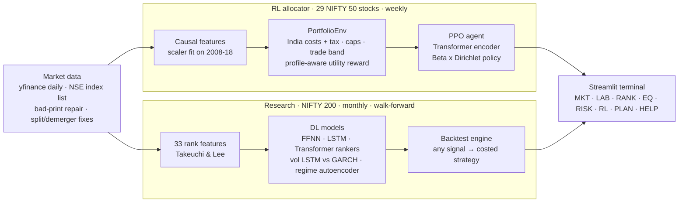

<div align="center">

# NiveshRL

**A deep-learning research terminal for Indian equities**

Stock rankers · volatility forecasting · market regimes · reinforcement-learning allocation · a backtest lab that charges real NSE costs


</div>

> **Educational research project, not investment advice.** NiveshRL is not registered with SEBI. Backtests use historical data and carry survivorship bias ([Limitations](#limitations)).

## What it is

NiveshRL asks whether deep learning adds anything over classic methods for **Indian equities, once real trading costs are paid**. It answers honestly: every prediction is walk-forward out-of-sample, and every trade pays contract-note-accurate NSE charges.

| Module | Model | Question it answers |
| --- | --- | --- |
| **Stock ranker** | FFNN 33-40-**4**-50-1 (Takeuchi & Lee), LSTM, Transformer vs logistic regression and 12-1 momentum | Which NIFTY 200 stocks will beat the median next month? |
| **Volatility forecaster** | LSTM vs GARCH(1,1), EWMA, historical | How volatile will each stock be next month? |
| **Regime detector** | autoencoder → 2-D embedding → k-means, refit yearly | Is the market in a Bull, Neutral or Stress state right now? |
| **RL allocator** | PPO actor-critic: permutation-equivariant Transformer encoder, Beta × Dirichlet policy | How should *this* investor split money across 29 NIFTY 50 stocks and cash? |
| **Backtest lab** | vectorised engine + India cost/tax model | What would a strategy built on any signal really have earned after costs? |

## The terminal

`streamlit run app.py` opens a dark, terminal-style dashboard with eight screens:

| Screen | What you can do |
| --- | --- |
| **MKT** Market monitor | **Live prices** (Yahoo Finance stream, refreshed every few seconds), NIFTY/VIX with regime shading, a NIFTY 200 sector heatmap (1D to 1Y), breadth, advancers/decliners, movers, the models' consensus picks. **Click any stock in the heatmap** to open its details in place: live price, valuation and profitability ratios, 52-week range, quarterly revenue and profit, income statement, balance sheet, cash flow, ownership, analyst targets and our models' view |
| **LAB** Backtest lab | Pick any signal, portfolio size, weighting, rebalance period, vol target, regime filter, costs and period. Get a full tearsheet (equity, drawdown, rolling Sharpe, monthly heatmap, VaR, regime split, turnover and costs, holdings, signal deciles and IC); compare up to 6 strategies; export the NAV |
| **RANK** Stock ranker | Out-of-sample scoreboard, IC by year, decile spreads, live ranking of all 194 stocks with sector filter |
| **EQ** Equity drilldown | One stock: price and averages, each model's monthly rank, volatility forecast vs realised, sector peers |
| **RISK** Vol and regimes | Forecaster scoreboard; regime timeline, regime map, out-of-sample regime statistics |
| **RL** RL allocator | The RL agent vs classical portfolios, with a cost slider |
| **PLAN** Investor plan | 6-question profile → whole-share orders, plain-language reasons, goal fan chart, 2020 crash replay |
| **HELP** How it works | A plain-language explainer for non-specialists |

## Headline results

Walk-forward out-of-sample, **Jan 2012 → Sep 2026**, NIFTY 200. Top 20 stocks, monthly rebalance, after real NSE costs.

| Strategy | CAGR | Sharpe | Max drawdown | Cost drag / yr |
| --- | --- | --- | --- | --- |
| Equal weight, same universe (**fair benchmark**) | 23.3% | 0.98 | −36.2% | 0.14% |
| Momentum 12-1 | 39.6% | 1.43 | −42.7% | 0.99% |
| Transformer ranker | 32.7% | 1.23 | −40.3% | 2.54% |
| Transformer ranker, quarterly rebalance | 32.7% | 1.23 | −37.3% | **0.89%** |
| Transformer ranker + regime filter | 28.2% | 1.21 | **−32.8%** | 2.19% |
| FFNN ranker (Takeuchi & Lee) | 33.0% | 1.19 | −41.0% | 2.22% |
| NIFTY 50 (price index) | 10.6% | – | – | – |

**What the results say:**
- **Plain momentum is the bar, and no deep model clears it.** The Transformer has the most *consistent* signal (monthly IC t-stat 4.7 vs 3.8 for momentum) but trades far more.
- **The Transformer's edge lasts a quarter.** Quarterly rebalancing keeps its return and cuts costs by about 1.6%/yr.
- **The regime filter trades return for drawdown.**
- **Judge everything against the equal-weight row, not NIFTY.** The universe is today's index members, which inflates absolute returns.

Full details: [Research results](#research-results-walk-forward-out-of-sample-2012--sep-2026).

## Architecture



**No-lookahead rules:**
- Features use data up to t only.
- Scalers are fit on training years.
- Every research prediction comes from a model trained on earlier years (rolling 8-year window).
- A unit test scrambles future labels and checks that past predictions don't change.

## Project structure

```
NiveshRL/
├── app.py                      # Streamlit router (8 screens)
├── demo.bat                    # one-click setup + launch (Windows)
├── configs/                    # universe, India costs & tax, corporate actions, hyperparameters
├── data/
│   ├── ind_nifty200list.csv    # NSE's official NIFTY 200 list
│   └── predictions/            # walk-forward model outputs (committed, so the app runs out of the box)
├── src/niveshrl/
│   ├── research/               # NIFTY 200 data, rank features, rankers, volatility, regimes, backtester
│   ├── dashboard/              # theme, cached store, one module per screen
│   ├── models/, algos/         # Transformer encoder, actor-critic, from-scratch PPO/A2C
│   └── *.py                    # RL data, features, costs, tax, env, rewards, baselines, planner, explain
├── scripts/                    # prepare_data, train_rankers, train_volatility, train_regimes, train_custom, evaluate, demo …
├── tests/                      # 101 tests
└── report/                     # results tables and figures
```

## Quickstart

```bash
git clone https://github.com/MananS8805/NiveshRL.git
cd NiveshRL
```

**One click (Windows):** double-click `demo.bat`. It creates `.venv`, installs packages, downloads data, trains the fast models (momentum, logistic regression, FFNN rankers, regimes, a demo-size RL run), and opens the dashboard. Steps whose outputs already exist are skipped, so later runs go straight to the app. Use `demo.bat --full` to also train the slow models (LSTM/Transformer rankers, volatility LSTM; hours on CPU). The same logic works anywhere with `python scripts/demo.py`.

Manual steps:

```bash
python -m venv .venv && .venv/Scripts/activate      # Windows; use bin/activate elsewhere
pip install torch --index-url https://download.pytorch.org/whl/cpu
pip install -r requirements.txt && pip install -e .
python scripts/prepare_data.py                     # download + data-quality report
pytest                                             # 101 tests: costs, tax, constraints, env, no-lookahead, walk-forward leakage
python scripts/sanity_toy.py                       # can PPO find the one drifting stock?
python scripts/run_baselines.py --split val
python scripts/train_custom.py --steps 500000 --seed 0
python scripts/train_sb3.py --algo ppo --steps 500000
python scripts/evaluate.py --split val --agent "NiveshRL=runs/ppo_cnn_dsr_reb5_s0"
# research platform (NIFTY 200)
python scripts/train_rankers.py                    # FFNN / LSTM / Transformer / logreg / momentum, walk-forward
python scripts/train_volatility.py                 # LSTM vs GARCH(1,1) / EWMA / historical
python scripts/train_regimes.py                    # autoencoder + k-means regimes
streamlit run app.py
```

## RL allocator: what's different from a typical DRL-portfolio project

| | Typical (FinRL-style) | NiveshRL |
|---|---|---|
| Costs | flat 0.1% | contract-note-accurate NSE charges + √-impact slippage, in ₹ ([costs.py](src/niveshrl/costs.py)) |
| Taxes | ignored | FIFO lots, STCG 20% / LTCG 12.5% above ₹1.25L, loss set-off ([tax.py](src/niveshrl/tax.py)) |
| Investors | one policy for everyone | **preference-conditioned** policy: risk aversion, drawdown tolerance, horizon, cash floor are inputs ([profile.py](src/niveshrl/profile.py)) |
| Limits | hoped for | **guaranteed** by projection: ≤10% per stock, ≤30% per sector, profile cash floor ([constraints.py](src/niveshrl/constraints.py)) |
| Architecture | MLP on flattened prices | permutation-equivariant Transformer: shared per-stock encoder + cross-stock attention ([encoder.py](src/niveshrl/models/encoder.py)) |
| Small accounts | fractional weights | whole shares, SIP-first rebalancing, cardinality limits ([planner.py](src/niveshrl/planner.py)) |
| Explanations | none | gradient × input → plain-language reasons, no LLM ([explain.py](src/niveshrl/explain.py)) |

**RL splits (chronological):** train 2008–2018 · validation 2019–2020 (includes the COVID crash) · **test 2021–2025, used once** · forward 2026 (paper trading).

## Design decisions worth knowing (and why)

- **Reward = Differential Sharpe Ratio** (Moody & Saffell) plus profile-weighted downside and drawdown penalties. A raw rolling-window Sharpe is noisy and non-Markov when used as a per-step reward. The DSR is its dense, incremental form.
- **The Dirichlet concentration is scheduled, not learned.** When it was learnable, the agent collapsed its own exploration noise, because noise means turnover and turnover costs money. It became "confidently uniform" before learning *where* to allocate. `scripts/sanity_toy.py` caught this: the one stock with positive drift got only 16% after 40k steps. The concentration now rises log-linearly from 10 to 300 during training.
- **Toy sanity check: partial pass so far.** In the synthetic market (`scripts/sanity_toy.py`) only S2 has real drift. The weight on S2 rose from 16% (learned concentration, 40k steps) to 28% (scheduled concentration, 60k) to 40% (150k), and S2 is the largest holding. It is still below the 45% pass bar. The agent also holds 26% in S5, whose true drift is zero but which *happened* to return +8.5%/yr over the toy training years. That is overfitting to one sample path, the same risk real market data carries, and it is the reason validation-based checkpoint selection and multi-seed runs matter here.
- **Risk-profile conditioning: diagnosed, partly fixed.** The first agents ignored the investor profile. From risk aversion 0 to 1, cash went only 3.9% → 4.6% and validation vol 21.4% → 21.1%. There were three causes, each measured:
  1. A Sharpe-type reward (DSR) cannot express a risk preference, because mixing the same stocks with more or less cash leaves the Sharpe roughly unchanged. It was replaced by the mean-variance utility r − (γ/2)r², with γ = 1…12 taken from the profile ([rewards.py](src/niveshrl/rewards.py)).
  2. Cash was 1 of 30 softmax scores, so a cautious investor needed a single score to beat 29 others. The policy now splits into a Beta "how much in stocks" head that reads the profile directly, times a Dirichlet "which stocks" head ([actor_critic.py](src/niveshrl/models/actor_critic.py)).
  3. The extra downside and drawdown penalties double-counted risk. They were about −18 per episode for a cautious profile against a +7 stock premium for a bold one, so training pulled *every* profile into cash (validation Sharpe fell to 0.01). With downside_k=0 and dd_mu=1, [reward_audit.py](scripts/reward_audit.py) confirms the reward prefers 100/100/100/50/25% stocks for risk aversion 0/.25/.5/.75/1 on 2008–18 data.

  The checkpoint score is now each preset profile's own utility, not the mean Sharpe. Result (100k-step verification run, best checkpoint at 40k, validation, no cash floor): cash 45.1% → 48.1% and vol 12.5% → 11.8% as risk aversion goes 0 → 1, **monotone at all 5 levels**, and Sharpe 0.74–0.76 for every profile. The direction is right, but the size is still far below the reward's own optimum (about 0% → 75% cash). Later checkpoints separated profiles more (80k: vol 13.4% vs 14.4%) but overfit the training years (validation Sharpe 0.56).
- **Log-writing bug fixed.** `log.csv` was appended under a header taken from the first row, so validation rows had more fields than the header. The trainer now rewrites the file with the union of columns, and [`read_log`](src/niveshrl/algos/ppo.py) recovers older logs.
- **Reward-scale bug caught early.** The first drawdown penalty was divided by a reference volatility and reached about 20 per step against a DSR of about ±0.5. The value loss (about 240) then dominated the shared encoder, and the first PPO update's KL was 0.59. After rescaling, the KL is ≤0.03.
- **No-trade band + dust filter: execution matters in India.** An untrained agent paid about 3.6× equal weight's costs at similar turnover. Two things caused it:
  - A continuous policy never outputs exactly the current weights, so it re-traded all 29 stocks every week. Each sale pays a flat ₹15.93 DP charge.
  - The env paid costs by shrinking *every* position, which put a sliver-sale (and a DP charge) on stocks that weren't meant to trade at all.

  The env now skips per-stock changes under 0.5% and trades under 0.1% of the portfolio. Costs come out of cash. This applies to every strategy. Equal weight's validation costs fell from ₹6,767 to ₹2,870 with CAGR unchanged.
- **Conv1d rewritten as a matmul** ([`WindowConv`](src/niveshrl/models/encoder.py)). It is numerically identical (max diff 2e-7) and training is 2.4× faster on CPU, because the mkldnn conv kernel is slow on L=12 sequences with batches of about 7,000.
- **Data fixes found by the quality report** ([prepare_data.py](scripts/prepare_data.py)):
  - NESTLEIND on yfinance is a frozen price with zero volume until Jan 2010, so it was swapped for BRITANNIA.
  - POWERGRID listed in Oct 2007, which would cut 2008 out of training, so it was swapped for HEROMOTOCO.
  - LT had a one-day bad print in Sep 2006 (−50%, then +95%), which was auto-repaired.
  - `^NSEI` on yfinance starts in Sep 2007, so data is aligned on stock trading days rather than benchmark days.

## Results

Validation (2019–2020), classical baselines after full NSE costs, ₹5 lakh portfolio:

| Strategy | CAGR | Vol | Sharpe | Max DD | Turnover/yr | Costs (₹) |
|---|---|---|---|---|---|---|
| Minimum variance | 22.8% | 19.6% | 0.85 | −26.6% | 1.4 | 6,509 |
| HRP | 21.2% | 20.8% | 0.75 | −30.7% | 1.5 | 7,253 |
| Momentum top-10 | 22.1% | 22.8% | 0.73 | −33.7% | 4.4 | 14,155 |
| Risk parity (inv-vol) | 19.6% | 22.4% | 0.65 | −34.5% | 1.1 | 4,784 |
| Equal weight | 19.4% | 23.2% | 0.63 | −35.3% | 0.8 | 2,870 |
| Markowitz max-Sharpe | 16.4% | 22.0% | 0.53 | −31.1% | 2.4 | 8,698 |
| NIFTY 50 (price index) | 13.1% | 24.4% | 0.38 | −38.4% | – | – |

### RL agents on validation (preliminary)

**Caveats first.** These numbers come from a single seed (0) on the validation split only. Each agent is its best-by-validation checkpoint from a training run that stopped early:
- **NiveshRL** (custom PPO, CNN encoder, DSR reward, 5-day rebalance): `best.pt`, saved at about 40k of 300k planned steps. The run stopped at about 102k.
- **SB3-PPO** (MLP): `best.zip`, saved at 40k steps. The run stopped at about 260k of 300k, and its validation Sharpe had drifted down to about 0.40–0.46 by then (overfitting).

Validation was also used to select these checkpoints, so the numbers are optimistic. Agents are run under the `aggressive` preset profile. The Sharpe logged during training is the mean over three preset profiles, which is why it does not match exactly. Produced by `scripts/evaluate.py --split val ... --frontier --cost-sweep` (full output: `runs/eval_val.out`, tables: `report/results/*_val.csv`).

| Strategy | CAGR | Vol | Sharpe | Max DD | Turnover/yr | Costs (₹) |
|---|---|---|---|---|---|---|
| Minimum variance | 22.8% | 19.6% | 0.85 | −26.6% | 1.4 | 6,509 |
| HRP | 21.2% | 20.8% | 0.75 | −30.7% | 1.5 | 7,253 |
| Momentum top-10 | 22.1% | 22.8% | 0.73 | −33.7% | 4.4 | 14,155 |
| Risk parity (inv-vol) | 19.6% | 22.4% | 0.65 | −34.5% | 1.1 | 4,784 |
| **NiveshRL (custom PPO)** | 18.8% | 21.4% | 0.64 | −33.1% | 0.9 | 2,821 |
| Equal weight | 19.4% | 23.2% | 0.63 | −35.3% | 0.8 | 2,870 |
| **SB3-PPO (MLP)** | 18.5% | 22.3% | 0.61 | −33.5% | 2.6 | 13,282 |
| Markowitz max-Sharpe | 16.4% | 22.0% | 0.53 | −31.1% | 2.4 | 8,698 |
| NIFTY 50 (price index) | 13.1% | 24.4% | 0.38 | −38.4% | – | – |

**Plainly: neither agent beats minimum variance, HRP, momentum or risk parity on validation.** NiveshRL is roughly tied with equal weight: Sharpe 0.64 vs 0.63, with slightly lower vol and drawdown, similar costs and lower CAGR. SB3-PPO is slightly below equal weight and pays about 4.6× its costs.

Sharpe difference (agent − other), 95% block-bootstrap CI:

| Agent | vs | Diff | 95% CI | P(diff ≤ 0) |
|---|---|---|---|---|
| NiveshRL | NIFTY 50 | +0.26 | [−0.10, +0.66] | 0.07 |
| NiveshRL | Equal weight | +0.01 | [−0.17, +0.15] | 0.51 |
| NiveshRL | Markowitz max-Sharpe | +0.11 | [−0.52, +0.97] | 0.34 |
| SB3-PPO | NIFTY 50 | +0.23 | [−0.10, +0.56] | 0.08 |
| SB3-PPO | Equal weight | −0.02 | [−0.15, +0.07] | 0.76 |
| SB3-PPO | Markowitz max-Sharpe | +0.08 | [−0.63, +1.00] | 0.40 |

Every CI includes zero, so no difference is statistically significant over two years of validation data.

**Risk-aversion frontier (NiveshRL, λ = 0 → 1).** Volatility is monotone decreasing in λ, but only barely: it moves from 21.4% to 21.1%. CAGR goes from 18.8% to 18.6% and Max DD from −33.1% to −32.8%. The preset profiles spread a little more: conservative 18.6% vol / −28.8% DD, moderate 20.9% / −32.4%, aggressive 21.4% / −33.1%. Much of that spread likely comes from the presets' cash floors rather than learned behaviour. At this checkpoint the policy is not yet meaningfully conditioned on the risk profile.

**Cost sweep (Sharpe at 0×, 1×, 4× the NSE cost schedule).**

| Strategy | 0× | 1× | 4× |
|---|---|---|---|
| Minimum variance | 0.88 | 0.85 | 0.80 |
| NiveshRL | 0.65 | 0.64 | 0.62 |
| Equal weight | 0.64 | 0.63 | 0.61 |
| SB3-PPO | 0.67 | 0.61 | 0.53 |
| Markowitz max-Sharpe | 0.57 | 0.53 | 0.45 |

NiveshRL's low turnover makes it about as cost-robust as equal weight. SB3-PPO has the best cost-free Sharpe of the three non-min-var strategies, but its high turnover makes it the most cost-sensitive agent. The 0.5× and 2× points are in `report/results/cost_sweep_val.csv`.

Full 300k-step reruns are in progress (`runs/ppo_cnn_dsr_reb5_s0_full`, `runs/sb3_ppo_mlp_s0_full`). Test-split (2021–2025) numbers have not been computed. They will be run once, at the end.

## Research platform (NIFTY 200)

Code in [src/niveshrl/research/](src/niveshrl/research/). The dashboard is in [src/niveshrl/dashboard/](src/niveshrl/dashboard/).

**Data.** NSE's official NIFTY 200 constituent list (`data/ind_nifty200list.csv`, with industry) and yfinance daily prices from 2006. 194 of the 200 stocks have usable history; the cross-section grows from 117 stocks (2007) to 194 (today). Unlike the RL universe, the panel keeps gaps: a stock is simply ineligible before it listed. Data hygiene ([research/data.py](src/niveshrl/research/data.py)):
- **Unadjusted splits and bonuses** are detected as daily moves landing on a standard ratio (×2, ×5, ×10, ½, ¼ …) and back-adjusted. Examples: VOLTAS ×10 (2006), MOTILALOFS 3:1 bonus (2024).
- **Demergers** have no standard ratio, so they are taken from a reviewed list, [configs/corporate_actions.csv](configs/corporate_actions.csv): Bajaj 2008, Adani Enterprises 2015, Tata Motors 2025, Vedanta 2026, plus ABB 2007.
- **Genuine events are left alone:** YES Bank 2020, the Oct 2017 PSU-bank recapitalisation, the Adani/Hindenburg fall (2023), COVID.
- One-day bad prints and frozen zero-volume runs are masked.

**Stock rankers** ([features.py](src/niveshrl/research/features.py), [rankers.py](src/niveshrl/research/rankers.py)). Setup follows Takeuchi & Lee (2013):
- **Inputs:** 33 per stock per month, all z-scored across stocks that month. 12 cumulative monthly returns (t−13 → t−2, skipping the latest month), 20 cumulative daily returns (last 20 days), and a January dummy.
- **Target:** does next month's return beat the cross-sectional median?
- **Models:**
  - FFNN 33-40-**4**-50-1 with a bottleneck, trained end to end (no RBM pretraining);
  - LSTM over 13 monthly returns plus the daily and January context;
  - 2-layer Transformer on the same inputs;
  - baselines: logistic regression and plain 12-1 momentum.
- **Validation: rolling-window walk-forward.** For each test year Y, train on the previous 8 years (the last 12 months used for early stopping), then predict every month of Y. Every score used anywhere is out of sample. A unit test scrambles future labels and checks that past predictions are unchanged. Hyperparameters are fixed a priori, not tuned on the out-of-sample years.

**Volatility forecaster** ([volatility.py](src/niveshrl/research/volatility.py)). Forecasts next-month realised vol per stock:
- **LSTM:** reads the last 60 daily returns plus realised-vol, VIX and market-vol context.
- **Baselines:** GARCH(1,1) refit yearly per stock, EWMA (λ=0.94), and last month's realised vol.
- **Scoring:** RMSE on log vol, QLIKE, and correlation, all walk-forward.

**Regime detector** ([regime.py](src/niveshrl/research/regime.py)):
- **Inputs:** 8 weekly market features: NIFTY return and volatility, VIX, breadth, dispersion, drawdown. Volatility-type features are measured relative to their own 1-year median.
- **Model:** autoencoder → 2-D embedding → k-means with 3 clusters, refit each year on past data only.
- **Naming:** clusters are named Bull / Neutral / Stress from their training-set statistics.

**Backtest lab** ([research/backtest.py](src/niveshrl/research/backtest.py)):
- **Signal:** any model or factor.
- **Portfolio rules:** top-N or top decile; equal, inverse-vol or score weighting; rebalance every 1–12 months; max weight per stock.
- **Overlays:** volatility target, regime filter.
- **Costs:** India delivery charges in ₹, the same model as the RL simulator.
- **No borrowing:** trades are sized on post-cost value, and buys are trimmed if cash would go negative.
- **Mode:** long-only by default; long-short is available for research only.
- **Tearsheet:** equity vs NIFTY and equal-weight, drawdown, rolling Sharpe, monthly heatmap, VaR/CVaR, performance by regime, turnover and cost per rebalance, holdings and sector exposure, signal deciles and IC.
- **Speed:** about 1 s per backtest.

**Dashboard screens:** MKT market monitor · LAB backtest lab · RANK stock ranker · EQ equity drilldown · RISK volatility and regimes · RL allocator · PLAN investor plan · HELP.

> **Read results against equal weight, not NIFTY.** The universe is *today's* NIFTY 200 applied to the past. Stocks that made it into the index are, by construction, past winners, which inflates every strategy's absolute return and especially momentum's. On 2012→2026 equal weight over this universe compounds at about 23%/yr versus NIFTY's about 11%/yr, and that gap is mostly survivorship.

### Research results (walk-forward out-of-sample, 2012 → Sep 2026)

**Ranking skill, before costs.** 176 months; every score comes from a model that never saw that month ([rankers_summary.csv](report/results/rankers_summary.csv)).

| Model | AUC | IC (mean) | IC t-stat | Months IC > 0 | Top − bottom decile / month |
|---|---|---|---|---|---|
| Transformer | 0.520 | 0.049 | **4.71** | **64%** | +1.32% |
| Momentum 12-1 (no learning) | **0.523** | **0.052** | 3.76 | 59% | **+1.47%** |
| FFNN 33-40-4-50-1 (bottleneck) | 0.516 | 0.041 | 4.10 | 59% | +1.36% |
| LSTM | 0.514 | 0.031 | 3.26 | 55% | +0.54% |
| Logistic regression | 0.507 | 0.017 | 1.84 | 59% | +0.39% |

**As strategies.** Top 20 stocks, equal weight, max 10% each, monthly rebalance, real NSE costs, ₹10 lakh, Jan 2012 → Sep 2026:

| Strategy | CAGR | Vol | Sharpe | Max DD | Turnover/yr | Cost drag/yr |
|---|---|---|---|---|---|---|
| Equal weight, all eligible (**the fair benchmark**) | 23.3% | 16.8% | 0.98 | −36.2% | 0.2 | 0.14% |
| Momentum 12-1 | 39.6% | 21.0% | 1.43 | −42.7% | 3.2 | 0.99% |
| FFNN | 33.0% | 21.0% | 1.19 | −41.0% | 7.2 | 2.22% |
| Transformer | 32.7% | 20.1% | 1.23 | −40.3% | 8.3 | 2.54% |
| LSTM | 25.8% | 20.0% | 0.96 | −44.6% | 10.1 | 3.07% |
| Logistic regression | 24.9% | 21.0% | 0.89 | −43.8% | 8.8 | 2.68% |
| Transformer + regime filter (Bull 1.0 / Neutral 0.8 / Stress 0.3) | 28.2% | 16.9% | 1.21 | **−32.8%** | 7.2 | 2.19% |
| Transformer, **quarterly** rebalance | 32.7% | 19.9% | 1.23 | −37.3% | **2.9** | **0.89%** |

NIFTY 50 over the same period: 10.6%/yr.

**What the results say:**
- **Plain 12-1 momentum is the model to beat, and none of the deep models beats it on this universe.** The Transformer comes closest. Its signal is the most *consistent* (IC t-stat 4.7, positive in 64% of months), but it trades far more than momentum. Survivorship bias flatters momentum most of all (index members are past winners), so the true gap is probably smaller than it looks.
- **The Transformer's edge lasts about a quarter.** Rebalancing quarterly keeps the same return and Sharpe but cuts costs by about 1.6%/yr. Monthly rebalancing mostly pays the broker and the exchequer.
- **The LSTM is weaker than the simpler FFNN, and logistic regression barely beats equal weight after costs.** A deep model is not automatically better.
- **The regime filter trades return for drawdown:** −40% → −33% max drawdown and vol 20% → 17%, with a similar Sharpe.
- Every strategy's absolute returns are inflated by survivorship bias. Read them against the equal-weight row.

**Regimes.** 822 weeks, 2011 → 2026, each labelled by a model fit only on earlier years ([regime_stats.csv](report/results/regime_stats.csv)):

| Regime | Share of weeks | Next 4 weeks NIFTY return | Next-month NIFTY vol | 4-week hit rate |
|---|---|---|---|---|
| Bull | 35% | +0.5% | 12.6% | 57% |
| Neutral | 59% | +0.6% | 15.4% | 61% |
| Stress | 6% | +2.7% | 20.6% | 69% |

The regimes separate **future volatility** well: 12.6% after Bull weeks vs 20.6% after Stress weeks. They do *not* predict direction. Stress weeks (2011, COVID 2020, 2026) were on average followed by rebounds. That is why the regime filter lowers drawdowns without raising Sharpe.

**Volatility forecaster: not finished yet.** The walk-forward LSTM had reached test year 2021 of 2026 when the run was stopped, so there are no LSTM-vs-GARCH results yet. The GARCH, EWMA and historical baselines are implemented and computed. Run `python scripts/train_volatility.py` (a few hours on CPU; faster with nothing else running) to produce `report/results/vol_summary.csv` and the RISK screen's scoreboard.

## Limitations

- **Survivorship bias:** the universe is today's NIFTY 50 constituents applied back to 2008. Stocks that dropped out of the index (or collapsed) are missing, which flatters every strategy's absolute returns. Comparisons *between* strategies stay fair because they all share the universe. The stretch fix is point-in-time index membership from niftyindices.com.
- The NIFTY benchmark is the **price** index, which excludes dividends (about 1.2–1.5%/yr). The stocks are dividend-adjusted by yfinance.
- The cost schedule is as of 2025 and is configurable in [costs_india.yaml](configs/costs_india.yaml). Check it against your broker's contract note.
- The tax model ignores carry-forward of losses across financial years and grandfathering.
- yfinance data is free but imperfect. The quality report exists because of that.
- Live prices come from Yahoo Finance's public stream. It is not exchange-grade, can lag NSE, and some symbols tick rarely; outside market hours (09:15-15:30 IST) the app shows the last close. Company financials are as reported on Yahoo Finance.
